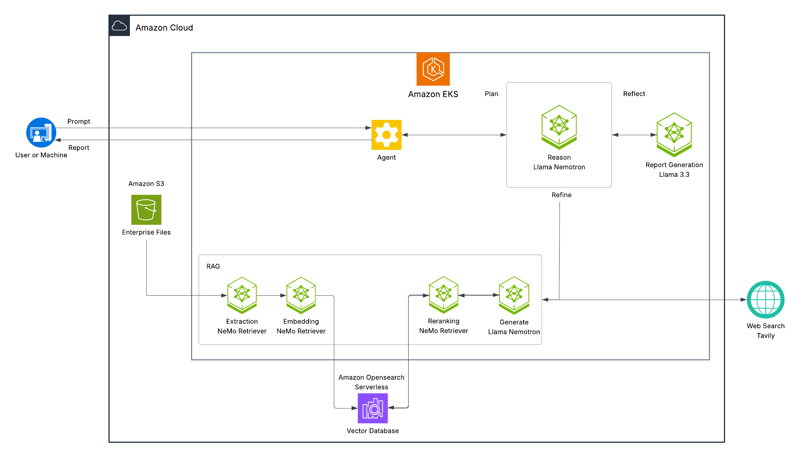

:::warning
This blueprint requires the [NVIDIA Deep Research Infrastructure](../../../infra/nvidia-deep-research.md) to be deployed first. GPU instance access is required (g5 family recommended).
:::

:::info
NVIDIA Deep Research combines RAG capabilities with AI-powered research assistance, leveraging multiple NVIDIA NIM microservices for enterprise-grade AI deployment on EKS.
:::

# NVIDIA Deep Research Blueprint

## Overview

The NVIDIA Deep Research Blueprint deploys an end-to-end AI research platform on Amazon EKS, featuring:

- **Multi-Modal RAG**: Process PDFs, images, tables, and charts with semantic search
- **AIRA Research Assistant**: Generate comprehensive research reports with web search
- **NVIDIA NIM Microservices**: Optimized inference containers for LLMs and vision models
- **Karpenter Autoscaling**: Dynamic GPU provisioning for cost-effective scaling
- **OpenSearch Serverless**: Managed vector database with AWS IRSA integration

## Architecture



### RAG Pipeline Architecture


### RAG Pipeline Components

1. **49B Nemotron LLM** (8x A10G GPUs)
   - Primary reasoning and generation model
   - Query rewriting and decomposition
   - Filter expression generation

2. **Embedding & Reranking** (1 GPU each)
   - LLama 3.2 NV-EmbedQA (2048-dim embeddings)
   - LLama 3.2 NV-RerankQA (relevance scoring)

3. **NV-Ingest Pipeline** (3-4 GPUs)
   - PaddleOCR for text extraction
   - Page/Graphic/Table element detection
   - Multi-modal content processing

4. **AIRA Components** (1 GPU)
   - 8B Instruct model for report generation
   - Web search via Tavily API
   - React frontend with NGINX proxy

### Karpenter-Based Scheduling

All components use Karpenter labels for automatic GPU provisioning:

```yaml
# 49B LLM - requires g5.48xlarge
nodeSelector:
  karpenter.k8s.aws/instance-family: g5
  karpenter.k8s.aws/instance-size: 48xlarge
  karpenter.sh/capacity-type: on-demand

# 1-GPU workloads - uses g5.xlarge through g5.12xlarge
nodeSelector:
  karpenter.k8s.aws/instance-family: g5
  karpenter.k8s.aws/instance-size: 12xlarge
```

**No manual node selection required** - Karpenter handles instance provisioning automatically!

## Prerequisites

1. **Infrastructure**: Deploy [NVIDIA Deep Research Infrastructure](../../../infra/nvidia-deep-research.md)
2. **NGC API Key**: [Register for NGC access](https://org.ngc.nvidia.com/setup/personal-keys)
3. **Tavily API Key**: [Get API key from Tavily](https://tavily.com/)
4. **kubectl & Helm**: Command-line tools configured
5. **OpenSearch Endpoint**: Retrieved from Terraform outputs

## Deployment

### Step 1: Configure Karpenter

Increase g5 NodePool memory limit for GPU workloads:

```bash
kubectl patch nodepool g5-gpu-karpenter --type='json' \
  -p='[{"op": "replace", "path": "/spec/limits/memory", "value": "2000Gi"}]'
```

### Step 2: Deploy RAG Blueprint

```bash
export NGC_API_KEY="<your-ngc-api-key>"
export OPENSEARCH_ENDPOINT="<from-terraform>"
export REGION="us-west-2"

helm upgrade --install rag \
  https://helm.ngc.nvidia.com/nvidia/blueprint/charts/nvidia-blueprint-rag-v2.3.0.tgz \
  --username '$oauthtoken' \
  --password "${NGC_API_KEY}" \
  -n nv-nvidia-blueprint-rag --create-namespace \
  -f helm/helm-values/rag-values-os.yaml \
  --set imagePullSecret.password="${NGC_API_KEY}" \
  --set ngcApiSecret.password="${NGC_API_KEY}"
```

Karpenter will automatically provision:
- 1x g5.48xlarge for the 49B model
- 2x g5.12xlarge for the 1-GPU models (bin-packed)

### Step 3: Deploy AIRA

```bash
export TAVILY_API_KEY="<your-tavily-api-key>"

helm upgrade --install aira helm/aiq-aira \
  -n nv-aira --create-namespace \
  -f helm/helm-values/aira-values.eks.yaml \
  --set imagePullSecret.password="$NGC_API_KEY" \
  --set ngcApiSecret.password="$NGC_API_KEY" \
  --set config.tavily_api_key="$TAVILY_API_KEY"
```

Karpenter provisions an additional g5 instance for AIRA.

### Step 4: Access Frontend

```bash
# Get AIRA frontend URL
kubectl get svc aira-aira-frontend -n nv-aira

# Get RAG frontend URL (optional)
kubectl get svc rag-frontend -n nv-nvidia-blueprint-rag
```

## Features

### RAG Capabilities

- **Multi-modal Document Processing**
  - Extract text, tables, charts, and images from PDFs
  - OCR for scanned documents
  - Audio transcription

- **Advanced Retrieval**
  - Dense vector search with embeddings
  - Reranking for improved relevance
  - Query decomposition for complex questions
  - Reflection for groundedness checking

- **Generation Features**
  - Citation support with source attribution
  - Conversation history for multi-turn chat
  - Streaming responses
  - Configurable temperature and top-p

### AIRA Research Assistant

- **Automated Research Reports**
  - Web search integration via Tavily
  - Multi-source information synthesis
  - Structured report generation

- **RAG Integration**
  - Query private knowledge base
  - Combine web and internal sources
  - Citation tracking

## GPU Utilization

Monitor GPU allocation across nodes:

```bash
# Check g5 nodes
kubectl get nodes -l karpenter.k8s.aws/instance-family=g5

# GPU allocation per node
kubectl describe nodes -l karpenter.k8s.aws/instance-family=g5 | grep nvidia.com/gpu

# Pod placement
kubectl get pods --all-namespaces -o wide | grep -E "nv-nvidia-blueprint-rag|nv-aira"
```

Typical allocation:
- **g5.48xlarge**: 8/8 GPUs (49B LLM)
- **g5.12xlarge #1**: 4/4 GPUs (Embedding, Reranking, Graphic, Page)
- **g5.12xlarge #2**: 4/4 GPUs (PaddleOCR, Table Structure, etc.)
- **g5.8xlarge**: 1/1 GPU (AIRA 8B)

## Performance

### Typical Response Times

- **Simple RAG Query**: 2-5 seconds
- **Complex Research Report**: 30-60 seconds
- **Document Ingestion**: ~1 second per page

### Scalability

- **Concurrent Users**: 10-20 with current setup
- **Documents**: Tested with 1000s of documents in vector DB
- **Auto-scaling**: Karpenter provisions additional nodes as needed

## Cost Estimation

Monthly costs (us-west-2, on-demand):

| Resource | Quantity | Unit Cost | Monthly Cost |
|----------|----------|-----------|--------------|
| g5.48xlarge | 1 | $16.29/hr | ~$11,890 |
| g5.12xlarge | 2 | $5.67/hr | ~$8,260 |
| g5.8xlarge (spot) | 1 | ~$1.80/hr | ~$1,310 |
| OpenSearch Serverless | 1 collection | ~$700 | $700 |
| EKS Control Plane | 1 | $0.10/hr | $73 |
| **Total** | | | **~$22,233/month** |

**Cost savings with Karpenter**:
- Consolidation during idle: Save 30-50% on auxiliary GPU nodes
- Spot instances: 70% savings on 1-GPU workloads
- Pay-per-use: No cost when nodes are scaled to zero

## Troubleshooting

### Pods Stuck in Pending

**Symptom**: GPU pods remain in Pending state

**Solution**: Check NodePool limits
```bash
kubectl patch nodepool g5-gpu-karpenter --type='json' \
  -p='[{"op": "replace", "path": "/spec/limits/memory", "value": "2000Gi"}]'
```

### Model Loading Timeout

**Symptom**: Pod fails startup probes

**Solution**: Increase startup probe timeout or wait longer (10+ minutes for 49B model)

### OpenSearch Access Denied

**Symptom**: Ingestion fails with 403 errors

**Solution**: Verify IRSA service account configuration
```bash
kubectl describe sa opensearch-access-sa -n nv-nvidia-blueprint-rag
```

## Cleanup

```bash
# Delete applications
helm uninstall aira -n nv-aira
helm uninstall rag -n nv-nvidia-blueprint-rag

# Karpenter will automatically terminate idle GPU nodes after consolidation period
# Or manually delete nodes
kubectl delete nodes -l karpenter.k8s.aws/instance-family=g5
```

## Additional Resources

- [Detailed Deployment Guide](https://github.com/awslabs/ai-on-eks/tree/main/blueprints/inference/nvidia-deep-research/README.md)
- [NVIDIA AI Blueprints - RAG](https://github.com/NVIDIA-AI-Blueprints/rag)
- [NVIDIA NIM Documentation](https://docs.nvidia.com/nim/)
- [Karpenter on EKS](https://karpenter.sh/)
- [OpenSearch Serverless Guide](https://docs.aws.amazon.com/opensearch-service/latest/developerguide/serverless.html)
